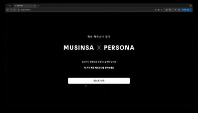
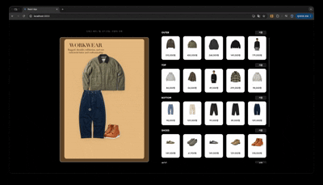

#  🎨 MUSINSA AI 기반 패션 스타일 매칭 및 코디 플랫폼

## 📌 프로젝트 개요

MUSINSA_WEB은 MUSINSA에 등록된 상품을 활용해 제작한 서비스입니다.

MUSINSA_WEB은 사용자의 패션 선호도와 라이프스타일을 분석하여 개인화된 패션 스타일(페르소나) 기반의 상품 추천을 제공하는 AI 웹 애플리케이션입니다.<br>
사용자는 직관적인 인터페이스를 통해 자신의 스타일을 진단받고, AI가 추천한 상품들을 조합하여 가상 코디(아웃핏)를 완성한 후 구매할 수 있습니다.

## ✨ 핵심 기능

📝 **스타일 진단**: 8개 질문을 통해 16가지 페르소나로 분류

[남성복 페르소나]
🏛️ GROUP A: 클래식 & 엘리트 (Classic & Elite)
- 💰올드머니 / 🎓프레피룩 / ⚪미니멀 / 👔오피스룩 
🛠️ GROUP B: 실용 & 헤리티지 (Utility & Heritage)
- 🛠️워크웨어 / 🌾아메카지 / 🌲고프코어 / 🪖밀리터리룩 
💣 GROUP C: 반항 & 개성 (Rebel & Identity)
- 🖤락시크 / 🎧그런지 / 🛹스트릿 / 💿Y2K 
🎾GROUP D: 스포티 & 캐주얼 (Sporty & Casual)
- 🏙️시티 보이 / ⚽블록코어 / 🏃애슬레저 / 💪머슬핏

[여성복 페르소나]
🏛️ GROUP A: 클래식 & 엘리트 (Classic & Elite)
- 클래식 / 🎓프레피룩 / ⚪미니멀 / 👔오피스룩 
🛠️ GROUP B: 실용 & 헤리티지 (Utility & Heritage)
- 🛠️워크웨어 / 레트로 / 🌲고프코어
💣 GROUP C: 반항 & 개성 (Rebel & Identity)
- 걸리시 / 시크 / 로맨틱 / 스트릿
🎾GROUP D: 스포티 & 캐주얼 (Sporty & Casual)
- 스포티 / 캐주얼


무신사 스타일 목록
캐주얼/미니멀/스포티/클래식/워크웨어/고프코어/프레피/에스닉/스트릿/걸리시/로맨틱/시크/시티보이/레트로/리조트

🤖 **AI 상품 추천**: 텍스트/이미지/카테고리 임베딩을 결합한 하이브리드 유사도 추천

👕 **가상 코디 (Collage)**: 드래그 앤 드롭으로 상품을 캔버스에 배치하여 나만의 아웃핏 구성

🔍 **금액 필터링**: 가격 범위(Slider) 조정을 통한 맞춤형 상품 탐색

🖼️ **배경 테마**: 사용자의 페르소나 스타일에 맞춰 변경되는 배경 UI

## 🤓 화면 미리보기

#### 📝 페르소나 검사

#### 🎨 추천 상품 조합


## 🏗️ 프로젝트 구조 및 아키텍처

### 📂 디렉토리 구조
```
MUSINSA_WEB/
├── backend/                          # Flask 기반 백엔드 서버
│   ├── app.py                        # 프로덕션 Flask 애플리케이션 (MySQL 연동)
│   ├── app_local.py                  # 로컬 개발 버전 (SQLite 연동)
│   ├── preprocess.py                 # MySQL DB 기반 마스터 데이터 생성
│   ├── preprocess_local.py           # 로컬 환경용 데이터 전처리
│   └── static/
│       └── processed_imgs/           # 배경제거(rembg) 처리된 이미지 저장소 (* 사용자가 추가해야합니다)
│
├── frontend/                         # React 기반 프론트엔드
│   ├── src/
│   │   ├── App.js                    # 메인 라우팅 및 상태 관리
│   │   ├── CollagePage.js            # 가상 코디 캔버스 (Drag & Drop)
│   │   ├── PurchasePage.js           # 최종 구매 페이지
│   │   ├── data.js                   # 페르소나 데이터 및 질문 세트
│   │   └── ... (CSS 및 컴포넌트)
│   ├── public/
│   │   └── backgrounds/              # 16개 페르소나별 배경 리소스
│   ├── concurrently
│   ├── frontend@0.1.0
│   ├── package-lock.json
│   └── package.json
│
└── requirements.txt                  # Python 의존성 패키지
```
### 🔄 데이터 흐름도 (Data Flow)
```
┌─────────────────────────────────────────────────────────────┐
│  사용자 (User / Web Browser)                                  │
└────────────────────┬────────────────────────────────────────┘
                     │ HTTP/REST API (Axios)
                     ▼
┌─────────────────────────────────────────────────────────────┐
│  Frontend (React)                                           │
│  ├─ Step 1: 스타일 성향 진단 (8문항 → 성향 도출)                   │
│  ├─ Step 2: 페르소나 선택 (성향별 4개 중 선택)                     │
│  ├─ Step 3: CollagePage (AI 추천 및 가상 코디)                  │
│  └─ Step 4: PurchasePage (최종 결제)                          │
└────────────────────┬────────────────────────────────────────┘
                     │ API Requests (/api/products)
                     ▼
┌─────────────────────────────────────────────────────────────┐
│  Backend (Flask)                                            │
│  │                                                          │
│  │ [API Endpoints]                                          │
│  ├─ /api/products: 페르소나/카테고리 기반 추천 로직 수행             │
│  ├─ /api/price-ranges: 카테고리별 가격 범위 반환                  │
│  └─ /api/outfit: 세션별 아웃핏 ID 관리                          │
│                                                             │
│  │ [Data & ML Layer]                                        │
│  ├─ master_data.npz 로드 (In-Memory Caching)                 │
│  ├─ Similarity Ranking (Cosine Similarity)                  │
│  │  └─ Style + Category + Brand + Image Vectors             │
│  └─ Image Processing (rembg 배경 제거)                        │
└────────────────────┬────────────────────────────────────────┘
                     │ Query / Load
                     ▼
        ┌────────────────────────────┐
        │ Database (MySQL / SQLite)  │
        └────────────────────────────┘
```
## 💻 기술 스택 (Tech Stack)  
### Backend (Python 3.8+)  

| 라이브러리 | 용도 | 비고 |
| :--- | :--- | :--- |
| **Flask** | REST API 서버 지원 |  |
| **SQLAlchemy** | DB 관리 |  |
| **PyTorch** | REMBG,AI 모델 | 이미지 처리,배경 제거 |
| **NumPy** | 벡터 연산 | 고속 유사도 계산 |
| **Pandas** | 마스터 데이터 관리  ||

### Frontend (Node.js 16+ / React)  

| 라이브러리 | 용도 | 비고 |
| :--- | :--- | :--- |
| **React 19** | UI 라이브러리 | Hooks, State 관리 |
| **Axios** | HTTP 클라이언트 | API 통신 |
| **React Scripts** | 빌드 도구 | Create React App |
| **Concurrently** | 개발 도구 | Front/Back 동시 실행 |

## 🔄 핵심 로직 상세 (Core Logic)
### 1. 스타일 진단 알고리즘
- Step 1 (성향 분류): 8개 문항의 응답을 분석하여 4가지 성향(A/B/C/D) 중 최고점 성향 도출.
  - A: 클래식/고급 (올드머니, 프레피룩, 미니멀, 오피스룩)
  - B: 기능성/내구성 (워크웨어, 아메카지, 고프코어, 밀리터리룩)
  - C: 개성/트렌드 (락시크, 그런지, 스트릿, Y2K)
  - D: 편안함/활동성 (시티보이, 블록코어, 애슬레저, 머슬핏)

- Step 2 (페르소나 결정): 도출된 성향 내에서 심화 질문을 통해 최종 16개 페르소나 중 하나를 확정.

### 2. AI 상품 추천 시스템 (/api/products)
다양한 벡터의 **가중치 합(Weighted Sum)**을 통해 유사도 점수를 계산하고 랭킹을 매깁니다.<br>
- Filtering: 사용자가 선택한 카테고리 및 가격 범위로 1차 필터링
- Vector Calculation: 페르소나 임베딩 벡터와 상품 벡터 간 코사인 유사도 계산
- Ranking: 점수 내림차순 정렬 후 상위 N개 반환

### 3. 데이터 전처리 및 로컬 모드
- Prod (MySQL): preprocess.py를 통해 DB에서 데이터를 조회하고 임베딩과 결합하여 master_data.npz 생성.<br>
- Local (SQLite): app_local.py 실행 시 musinsa_db_dump.sql을 파싱하여 경량화된 SQLite DB를 자동 구축. (MySQL 설치 없이 실행 가능)

## 🚀 설치 및 실행 방법 (Setup)
#### 1. 환경 변수 설정 (.env)
프로젝트 루트에 .env 파일을 생성한 뒤, 해당 내용을 작성합니다.

DB_HOST=your_local_host  
DB_USER=your_username  
DB_PASSWORD=your_password  
DB_NAME=your_db_name  

#### 2. 의존성 설치
- cd backend <br>
  pip install -r requirements.txt (백엔드)

- cd frontend <br>
  npm install (프론트엔드)

#### 3. 마스터 데이터 생성 (최초 1회)
- python preprocess_local.py  # 로컬(SQLite) 사용 시
- python preprocess.py      # MySQL 사용 시

#### 4. 개발 서버 시작
npm run dev <br>(명령어를 사용하면 백엔드(port:5000)와 프론트엔드(port:3000)를 동시에 실행할 수 있습니다.)

#### (참고) 백엔드 서버 실행
- python app_local.py         # 로컬 모드
- python app.py             # 프로덕션 모드

## 📊 데이터 스키마 (master_data.npz)
빠른 추천을 위해 모든 상품 정보와 벡터는 압축된 NumPy 포맷으로 캐싱됩니다.  

| 키(Key) | 차원 | 설명 |
| :--- | :--- | :--- |
| **ids** | (N,) | 상품ID  |
| **names** | (N,) | 상품명 |
| **prices** | (N,) | 가격 |
| **imgs** | (N,) | 이미지URL |
| **name_vecs** | (N, 200) | 상품명 텍스트 임베딩 |
| **img_vecs** | (N, 512) | 상품 이미지 임베딩 (ResNet/CLIP) |
| **style_vecs** | (N, Style) | 페르소나별 적합도 벡터 |

## 📈 성능 최적화 (Optimization)
#### Backend:

- In-Memory Caching: 서버 기동 시 master_data.npz를 메모리에 로드하여 I/O 오버헤드 제거.  
- Vector Normalization: 사전 L2 정규화를 통해 코사인 유사도 연산 속도 향상.  
- NumPy Broadcasting: 반복문 없는 벡터화 연산으로 추천 로직 가속화.  

#### Frontend:
- Image Optimization: 배경 제거 이미지를 사용하고 CSS Transform을 활용해 렌더링 부하 최소화.  
- Request Caching: Axios 요청 시 중복 호출 방지 및 캐시 버스팅 적용.  

## 🙋 FAQ

Q: 페르소나는 왜 16개인가요? <br>
A: MBTI와 유사하게 4가지 핵심 성향(A/B/C/D)을 기반으로, 각 성향을 4가지 세부 스타일로 나누어 총 16개의 유니크한 패션 스타일을 정의했습니다.  

Q: 로컬에서 MySQL 없이 실행 가능한가요? <br>
A: 네! app_local.py는 SQL 덤프 파일을 자동으로 SQLite로 변환하여 구동되므로 별도의 DB 설치 없이 테스트 가능합니다.  

Q: 새로운 상품 추가는 어떻게 하나요? <br>
A: DB에 상품을 추가한 후 preprocess.py를 재실행하면 임베딩을 다시 계산하여 master_data.npz를 업데이트합니다.  

Last Update: 2026/01/15 
Developed by: 데이터분석가 과정 4조 Team 데스노트

** 해당 프로젝트는 2025 하반기 멀티캠퍼스 데이터분석가 과정 프로젝트 4조 Team 데스노트의 최종 산출물입니다.**
